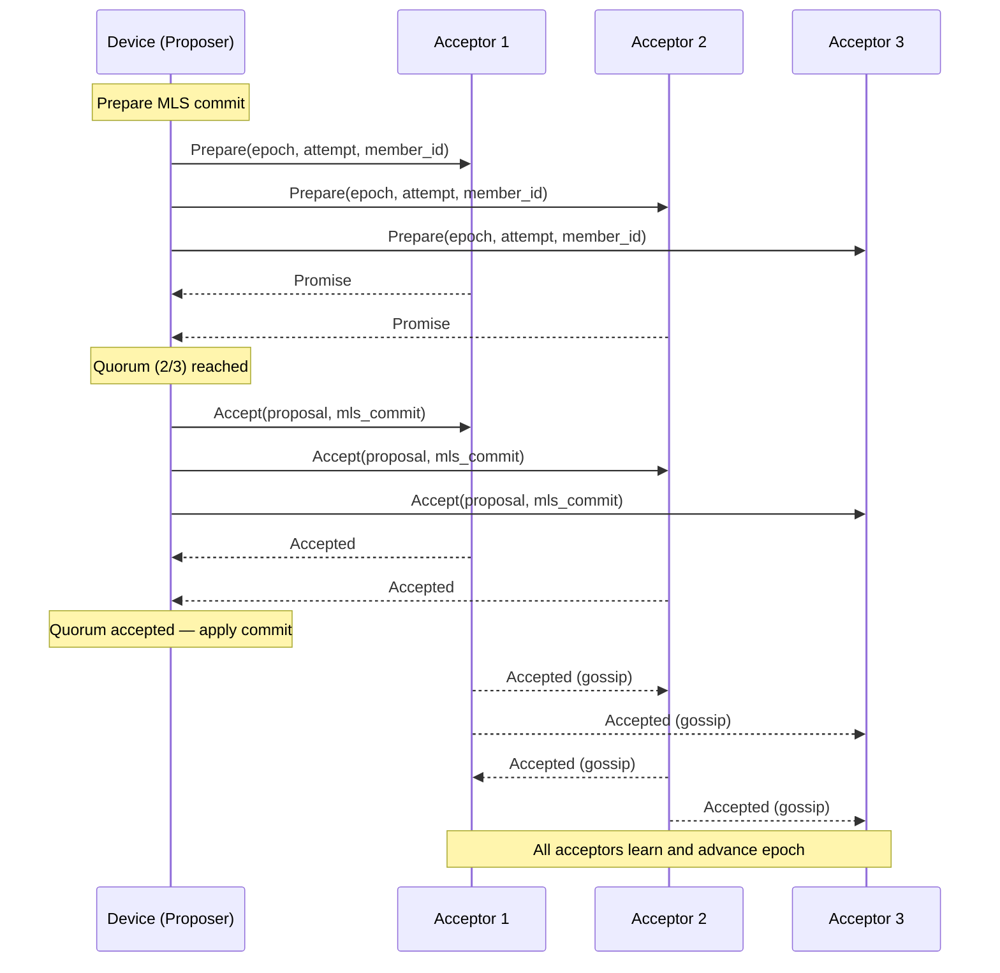
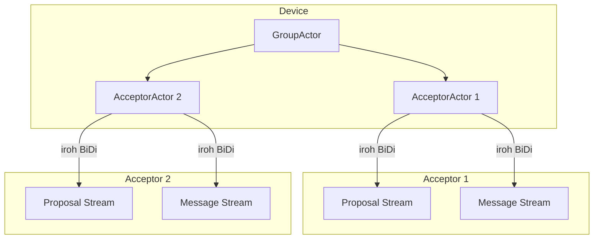
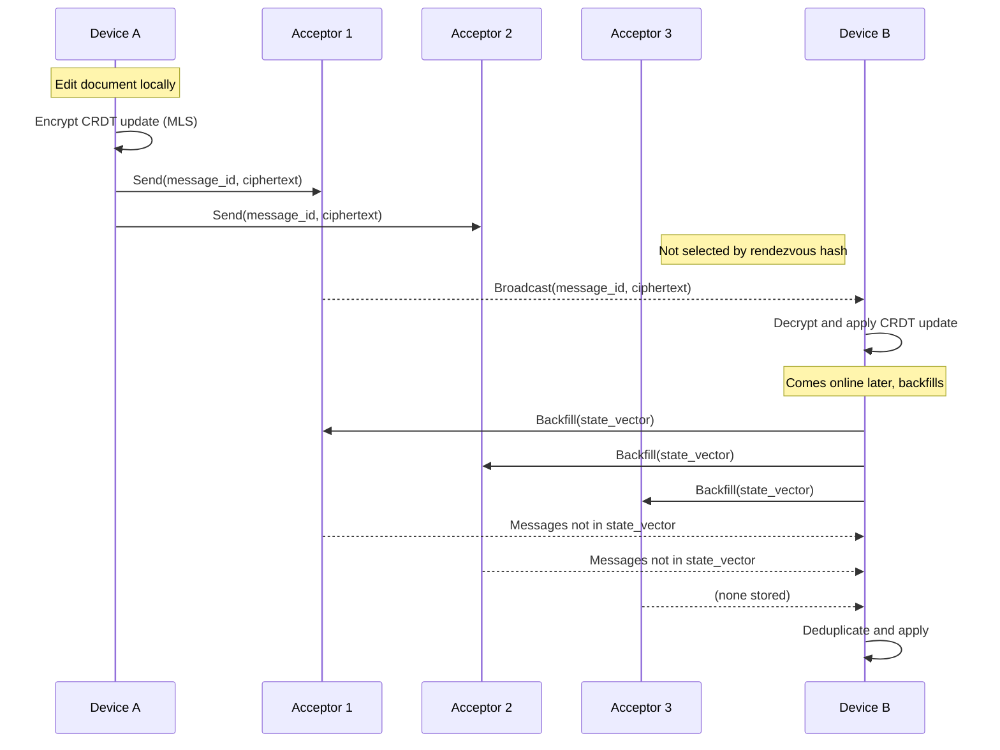

# Architecture Details

Implementation details for the filament protocol. For a high-level
overview, see [README.md](README.md).

## MLS Extensions and Proposals

Custom MLS extensions carry protocol-specific data. All share a single
extension type (`0xF796`) in the private-use range, disambiguated by which
MLS context they appear in.

| Extension / Proposal | Context | Purpose |
|-----------------------|---------|---------|
| `GroupContextExt` | Group context | CRDT type identifier and compaction config |
| `KeyPackageExt` | Key package | Member iroh address and supported CRDT types |
| `GroupInfoExt` | Group info | Current acceptor list and optional CRDT snapshot |

Custom proposals share a single proposal type (`0xF796`) via the
`SyncProposal` enum:

| Proposal | Purpose |
|----------|---------|
| `SyncProposal::AcceptorAdd` | Add an acceptor server to the group |
| `SyncProposal::AcceptorRemove` | Remove an acceptor server from the group |
| `SyncProposal::CompactionClaim` | Claim a compaction lease |
| `SyncProposal::CompactionComplete` | Mark compaction as finished |

## Paxos Protocol Details

### Ballot Scheme

Ballots are `(Epoch, Attempt, MemberId)` with lexicographic ordering.
`MemberId` is the MLS leaf index, guaranteed unique within the group.

### Two-Phase Protocol

Every round requires two phases (Prepare → Promise, Accept → Accepted).
Multi-Paxos leader optimisation is explicitly disabled — every Accept must
match an exact prior Promise. Contention between concurrent proposers is
resolved by incrementing the attempt number and retrying.



### Acceptor Membership Changes

Acceptor membership changes (`AcceptorAdd` / `AcceptorRemove`) are themselves
MLS custom proposals agreed through Paxos. Quorum size updates atomically
when the commit is applied.

## iroh Connection Architecture

Each device opens two bidirectional streams per acceptor via iroh:

1. **Proposal stream** — Paxos Prepare/Accept messages.
2. **Message stream** — application message send, subscribe, and backfill.



## CRDT Message Identity and Deduplication

CRDT updates are MLS application messages identified by
`(MemberFingerprint, seq)` where `MemberFingerprint` is a SHA-256 of the
sender's MLS signing key. This identity is stable across MLS epochs.

Messages are deduplicated at two levels:

- **Acceptor**: storage key is `(group_id, sender_fingerprint, seq)` —
  duplicate writes overwrite silently.
- **Device**: in-memory `HashSet<(MemberFingerprint, seq)>` filters
  duplicates before CRDT application.

A per-sender state vector tracks the highest received sequence number,
used for backfill requests.

## Message Routing

Not every application message needs to reach every acceptor. Messages are
routed to a subset of acceptors selected by rendezvous hashing (Highest
Random Weight, using xxh3). The number of target acceptors is determined
by an exponential delivery function:

```
delivery_count(level, counts_len, n) = ceil(e^(level - counts_len) * n)
```

For regular application messages (`level=0`, default `counts_len=2`),
this gives `ceil(e^-2 * n)` ≈ 13.5% of acceptors (minimum 1). Higher
compaction levels replicate to progressively more acceptors, approaching
all acceptors at the highest level. This distributes storage load while
maintaining deterministic routing — any device can compute which
acceptors hold a given message.

Devices connect to all acceptors and subscribe to live broadcasts plus
backfill, so they receive the full message set across all acceptors.



## Acceptor Storage

Acceptors use [fjall](https://github.com/fjall-rs/fjall) (an LSM-tree
storage engine) with three keyspaces:

| Keyspace | Key | Value |
|----------|-----|-------|
| `accepted` | `(group_id, epoch)` | `SlimAccepted` (proposal + message); sentinel at `epoch=u64::MAX` stores the last promised proposal |
| `snapshots` | `(group_id, epoch)` | `ExternalSnapshot` bytes (full group state for crash recovery) |
| `messages` | `(group_id, sender_fingerprint, seq)` | Encrypted application message |

Accepted and promised writes are fsynced before acknowledging. Snapshot
writes do not fsync (recoverable from accepted values). On server restart,
the latest snapshot is loaded and only subsequent accepted commits are
replayed — not from epoch 0. Snapshots are pruned logarithmically.

See [plan/ACCEPTOR-STORAGE.md](plan/ACCEPTOR-STORAGE.md) for details.
