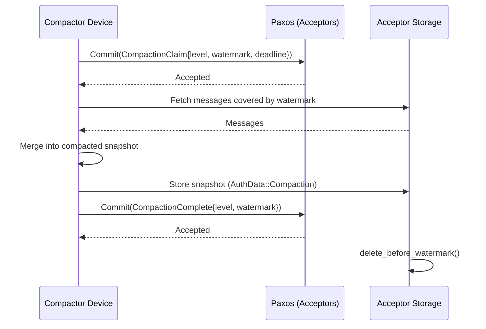

# filament

Federated sync engine built on MLS, Paxos, iroh, and CRDTs.

Synchronise documents between multiple devices through a federated set of
untrusted servers, with end-to-end encryption and local-first editing.
Devices exchange encrypted CRDT updates through the servers; the shared
document is eventually consistent without the servers ever seeing its contents.

## Architecture

### Overview

Devices communicate through a small set of federated **acceptor** servers.
These servers are untrusted — they cannot read or forge messages — but are
expected to maintain availability and not withhold messages. Running multiple
servers under independent administrators makes availability and withholding
attacks impractical. Servers can be added or removed at any time.

All messages are signed and encrypted with MLS, providing forward secrecy and
post-compromise secrecy. The servers see group metadata (membership, timing)
but never message contents.

There are two classes of messages with different delivery paths:

- **Application messages** (CRDT updates) are local-first. They bypass
  consensus and are routed to a subset of acceptors for storage. They can be
  sent and received asynchronously, including while offline.
- **Commits** (membership changes, key rotation, compaction) require global
  ordering. They go through Paxos consensus across all acceptors.

Each device connects to every acceptor over iroh. Per acceptor, a device
opens two streams: a **proposal stream** for Paxos consensus and a
**message stream** for CRDT updates. Application messages are routed to a
deterministic subset of acceptors; commits go to all of them.

### Crate structure

| Crate | Role |
|-------|------|
| `filament-warp` | Core Multi-Paxos state machines (pure + async runtime) |
| `filament-core` | Shared types, protocol messages, CRDT traits, MLS extensions |
| `filament-weave` | Device/client library — group management, message routing |
| `filament-spool` | Server library — Paxos acceptor, message storage, backfill |
| `filament-testing` | Integration test harness |
| `filament-editor` | Tauri desktop editor application |

## MLS ([Messaging Layer Security](https://en.wikipedia.org/wiki/Messaging_Layer_Security))

MLS provides the group key agreement protocol. Each document has its own MLS
group. MLS handles:

- Encrypting and signing all messages (application messages and commits).
- Efficiently adding and removing members from the sync group.
- Epoch-based key rotation for forward secrecy.

Custom MLS extensions carry protocol-specific data such as the CRDT type,
compaction configuration, acceptor list, and member addresses. Custom
proposals manage acceptor membership and compaction leases. See
[ARCHITECTURE.md](ARCHITECTURE.md) for the full extension and proposal list.

## Paxos

MLS application messages work asynchronously, but MLS commits must be
processed in a globally consistent order. Paxos provides this serialisation.

- **Proposers** — devices proposing a commit (add/remove member, update keys,
  compaction). Each device acts as an independent proposer; there is no leader
  election.
- **Acceptors** — the federated servers. They store promises and accepted
  values. Quorum is `floor(n/2) + 1`.
- **Learners** — all devices and acceptors. They observe accepted commits and
  advance the MLS epoch.

Commits require two round trips (Prepare/Promise then Accept/Accepted) and a
quorum of acceptors must agree before a commit is applied. See
[ARCHITECTURE.md](ARCHITECTURE.md) for the ballot scheme, sequence diagram,
and protocol details.

## iroh

All network communication uses [iroh](https://www.iroh.computer/). Devices
connect to acceptor servers over iroh, which provides NAT traversal, relay-based
fallback transport, and multiplexed bidirectional streams. See
[ARCHITECTURE.md](ARCHITECTURE.md) for the connection architecture.

## CRDTs ([Conflict-free Replicated Data Types](https://en.wikipedia.org/wiki/Conflict-free_replicated_data_type))

Document changes are local-first. Edits happen offline and synchronise when
connectivity is restored. Since there is no global ordering of edits, CRDTs
ensure all devices converge to the same document state.

Application messages are routed to a subset of acceptors for storage.
Devices connect to all acceptors and reconstruct the full message set via
live broadcasts and backfill. See [ARCHITECTURE.md](ARCHITECTURE.md) for
message routing, deduplication, and rendezvous hashing details.

### Compaction

Over time, CRDT updates accumulate. Hierarchical LSM-style compaction merges
older updates into compressed snapshots. A device claims a compaction lease
via Paxos, merges the covered updates, stores the compacted result, and
finalises via a second commit. Acceptors then delete the superseded messages.

Compacted snapshots serve as catch-up points for offline or new devices —
they backfill the snapshot plus any updates after the compaction watermark.

## Trust model

| Property | Guarantee |
|----------|-----------|
| Message confidentiality | MLS encryption; acceptors cannot read contents |
| Message integrity | MLS signatures + AAD; acceptors cannot forge or reorder |
| Availability | Federated; quorum of acceptors required |
| Forward secrecy | MLS epoch-based key rotation |
| Post-compromise secrecy | MLS key rotation on commits |

Acceptors are untrusted for secrecy and integrity. They are semi-trusted for
availability — a colluding quorum can cause denial of service but cannot
compromise message contents. Metadata (group membership, message timing and
frequency) is visible to acceptors.

Members within a group are fully trusted.

## Why "Filament"?

A filament is a thin, strong thread that conducts and connects. The sub-crate
names extend the textile metaphor:

- **warp** — the structural threads held taut on a loom. The Paxos consensus
  layer provides the fixed ordering that everything else is woven around.
- **weave** — the act of passing thread through the warp. The proposer layer
  weaves application messages and commits through the consensus scaffold.
- **spool** — where thread is wound for storage. The acceptor layer stores and
  serves encrypted messages on behalf of the group.
